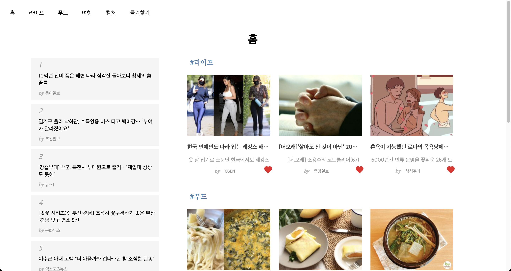
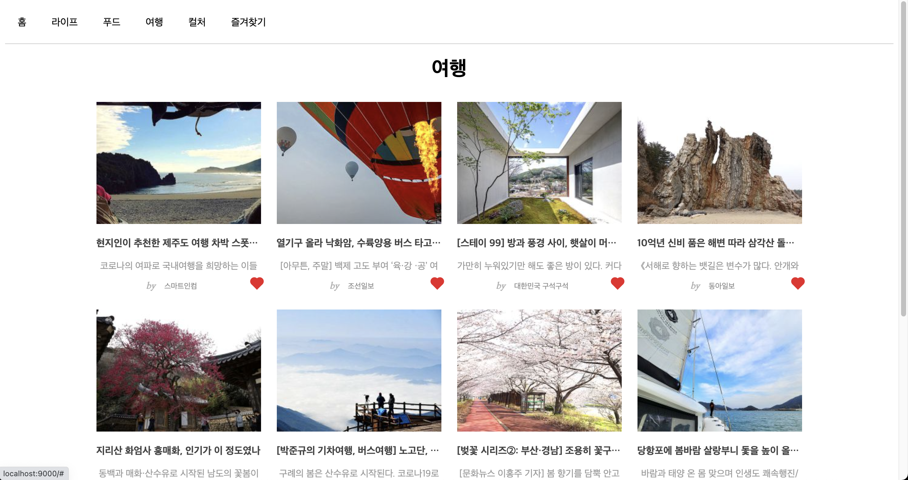
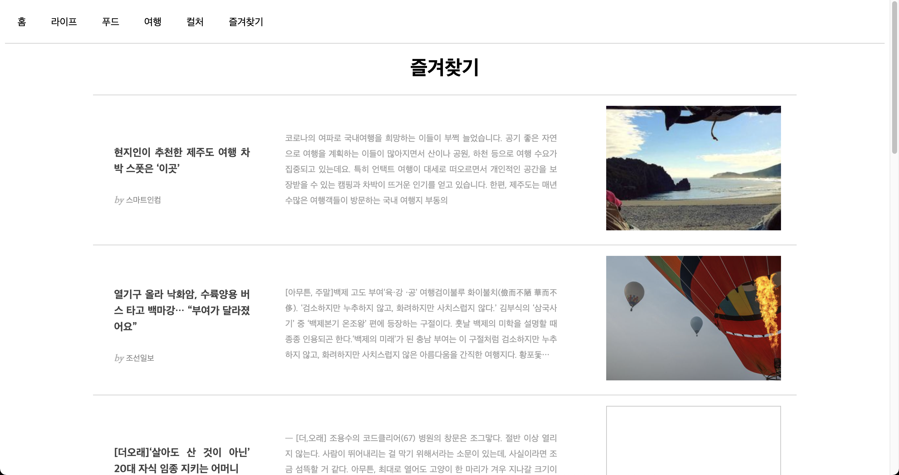

# Zum assignment

### Back-End
* Server based on express
* Using port 3000

#### API END POINT
|url|description|type|
|---|---|---|
|/api/life|life json |GET|
|/api/rank|rank json |GET|
|/api/food|food json |GET|
|/api/travel|travel json |GET|
|/api/culture|culture json |GET|
|/detail/:category/:id|scrap from origin source|GET|

```shell
$ cd backend

$ node server.js
```

### Front-End
* based on vanilla JS
* webpack, babel 개발환경 settings
#### Function
* 홈 / 라이프 / 푸드 / 여행 / 컬쳐 / 즐겨찾기 화면 구성
* Router
* Favorite 
* Image lazy loading 
* Infinity scroll
* Simple cache 
* XHR loading -> fail....


```shell
$ npm install

$ npm start
```

### Screen




